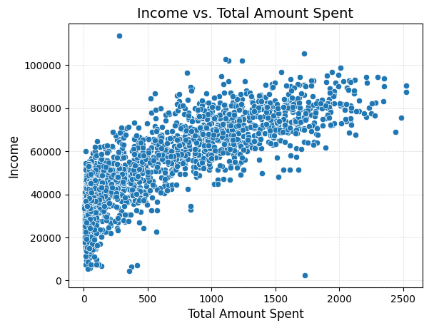
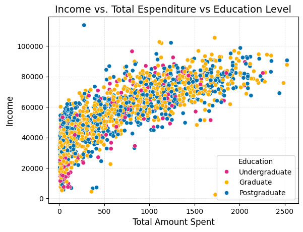
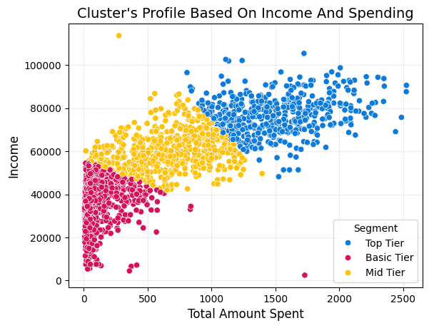

# Customer Segmentation for Strategic Marketing: An Analysis of Consumer Behavior, Shopping Methods, and Promotion Engagement
========================

## Project Overview

This project focuses on **customer segmentation** using a robust data-driven approach to provide actionable insights for strategic marketing initiatives. By applying **K-Means clustering**, we identify distinct customer groups based on their **purchasing behaviors, preferred shopping channels, and engagement with promotional campaigns**. This comprehensive analysis, enriched with demographic and expenditure data, aims to empower businesses to tailor their strategies, optimize resource allocation, and enhance customer relationship management.

## Research Objectives

The core objectives guiding this analysis are:
1. **Consumer Behavior Segmentation:** To identify unique customer segments based on their product purchasing patterns and preferences across various categories (e.g., wines, fruits, meat, gold), and understand how these behaviors correlate with demographic and income characteristics.

2. **Buying Methods Segmentation:** To differentiate customer groups based on their preferred purchasing channels (e.g., online, in-store, catalog, web visits), revealing distinct shopping habits and their relationship with demographics and total expenditure.

3. **Promotions Participation Segmentation:** To categorize customers by their responsiveness and engagement with marketing campaigns and promotions, determining the demographic and behavioral factors that influence their participation, to optimize future promotional strategies.

## Methodology & Research Context

* **Research Context:** Consumer Behavior & Market Research
* **Nature of Research Inquiry:** Primarily Exploratory (to discover underlying segments) and Descriptive (to characterize these segments).
* **Status of Data Source:** Primary Research
* **Type of Data:** Quantitative and Qualitative (encoded)
* **Mode of Data Collection:** Ad hoc Research
* **Method of Data Collection:** Online
* **Research Design:** Cross-sectional

## Skills Demonstrated

* **Data Acquisition & Understanding:** Sourcing and comprehending complex customer datasets.
* **Data Preprocessing:** Robust handling of missing values, outlier detection and treatment, and feature scaling.
* **Feature Engineering:** Creating new meaningful features from raw data (e.g., customer age, total expenditure).
* **Exploratory Data Analysis (EDA):** Performing in-depth univariate, bivariate, and multivariate analysis to uncover initial insights and relationships.
* **Clustering Algorithms:** Implementation of K-Means for unsupervised customer segmentation.
* **Model Evaluation:** Utilizing techniques like the Elbow Method and Silhouette Score to determine optimal cluster numbers.
* **Cluster Interpretation & Profiling:** Detailed analysis and clear description of each identified customer segment.
* **Data Visualization:** Creating insightful and compelling visualizations to communicate complex findings effectively.

## Data Source

The dataset used for this project is "Customer Personality Analysis" retrieved from [Kaggle](https://www.kaggle.com/):
* Source: [https://www.kaggle.com/datasets/imakash3011/customer-personality-analysis/data](https://www.kaggle.com/datasets/imakash3011/customer-personality-analysis/data)

## Deliverables

#### `eda.ipynb` - Exploratory Data Analysis & Feature Engineering

This notebook contains the foundational analysis of the customer dataset. It includes essential steps such as **data cleaning, feature engineering**, and a thorough **exploratory data analysis (EDA)** to uncover initial trends and relationships. The analysis covers the distribution of various variable types and explores correlations between features, providing the groundwork for the subsequent modeling phase.

#### `modeling.ipynb` - K-Means Clustering & Customer Segmentation

This notebook details the entire **customer segmentation** process using the **K-Means algorithm**. It includes key steps like data preprocessing (encoding and standardization), model implementation, cluster evaluation and interpretation. The notebook concludes with the generation of detailed **segment profiles**, offering actionable insights for targeted marketing strategies.

## Key Findings (Sample Visualizations)

This project's core strength lies in its ability to reveal meaningful customer segments that are not immediately apparent through traditional analytical approaches. Below, we illustrate this power by comparing simple data views with the insights gained through sophisticated clustering.

### The Power of Clustering: Uncovering Hidden Structures

To highlight how K-Means clustering enhances our understanding, let's examine the relationship between customer Income and Total Spending, progressively adding more layers of insight.

#### 1. Bivariate View: Income vs. Total Spending

A basic scatter plot reveals a general positive correlation between income and total spending – higher income often correlates with higher expenditure. However, it doesn't clearly show distinct customer groups or reasons for variations.

*Figure 1: Basic relationship between customer income and overall spending.*

#### 2. Multivariate View: Income vs. Total Spending vs. Education Level

Adding a third dimension, like Education Level (represented by different colors), starts to hint at some differentiation. We might observe that certain education groups tend to cluster in specific income/spending ranges. While this adds a layer of information, it's still challenging to define clear, actionable customer segments based solely on these visual cues. The boundaries between groups remain ambiguous.

*Figure 2: Income and spending, colored by customer education level. While some patterns emerge, distinct actionable groups are not clearly defined.*

#### 3. Clustered View: Income vs. Total Spending vs. Customer Segments

Here, the power of K-Means clustering becomes evident. By applying the clustering algorithm, we're able to automatically identify and delineate distinct customer segments that share similar underlying characteristics across all features. When these segments are visualized against Income and Total Spending, they reveal well-defined and often intuitively understandable groups. This plot clearly demonstrates how sophisticated analytical techniques provide precise, actionable insights beyond what simple visual inspection can offer. We can now clearly see how income and spending patterns contribute to the formation of specific customer segments.

*Figure 3: Income and spending, colored by the automatically generated customer segments. Distinct groups with unique income and spending profiles are clearly visible, enabling targeted marketing strategies.*

---

## Technologies Used

| Tool/Library   | Purpose                                                               |
| :------------- | :-------------------------------------------------------------------- |
| Python         | Primary programming language for data analysis                        |
| Pandas         | Data manipulation and analysis, handling DataFrames                   |
| NumPy          | Numerical computing with arrays and matrices                          |
| Scikit-learn   | Machine learning algorithms, including StandardScaler, and KMeans     |
| Matplotlib     | Fundamental library for creating visualizations                       |
| Seaborn        | High-level data visualization library based on Matplotlib             |
